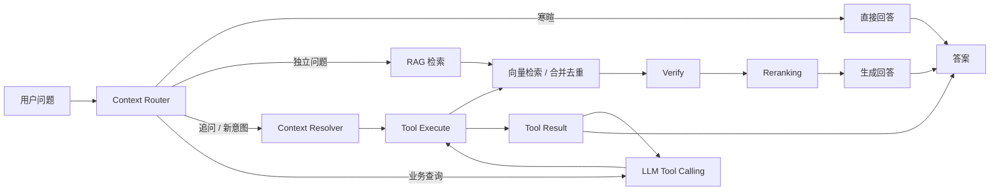

# Enterprise Knowledge Agent

面向企业内部知识库的多轮对话 Agent，支持 RAG 问答、上下文理解、Memory、工具路由和演示级权限控制。

`RAG` · `Multi-turn` · `Memory` · `Tool Router` · `RBAC` · `Evaluation`

## 项目简介

这个项目模拟企业员工查询公司制度、排班、报销和行政信息的场景。用户可以上传内部文档，通过对话检索资料并获得带来源的回答，也可以查询演示业务工具或在后续会话中继续使用自己的偏好信息。

系统把多轮上下文处理放在 RAG 流程前面：先判断当前请求是寒暄、独立问题、追问还是新意图，再决定直接回答、恢复上下文、检索文档或调用业务工具。

## 核心功能

### 知识库问答

支持 PDF、DOCX、TXT、Markdown 文档的上传、解析、切分、向量化和 Chroma 存储。检索结果经过相关性检查和 Reranking，回答返回引用片段。

### 多轮对话

系统能处理指代、省略和跨轮引用。例如用户先问“`A组这周怎么排班？`”，再问“`那么B组呢？`”，Context Resolver 会在配置 LLM 时把追问改写成完整的检索问题。

### 双路检索

多轮问题同时使用原始 Query 和改写 Query 召回，按文档片段去重后再验证和排序。改写失败时回落到原始 Query，不会因为没有 LLM 而让接口报错。

### Memory

按 `user_id` 保存和读取用户相关信息，长期 Memory 与短期会话历史分开管理，并且不会作为知识库引用。

### Tool Router

优先使用兼容 OpenAI API 的模型执行 provider-native Tool Calling，由模型从三个标准工具中选择并生成结构化参数：查询年假、查询报销状态、查询会议室。工具由独立 Executor 执行，结果通过 Tool Message 回传模型生成最终回答；没有 API Key、模型不支持工具调用或 provider 响应解析失败时，回落到 deterministic Tool Router。

### 权限控制

通过请求头 `X-Role` 演示 `employee`、`hr`、`finance`、`admin` 和 `manager` 角色，在生成回答前过滤受限文档。它不替代 JWT、OAuth 或 SSO。

### API 与反馈

提供普通问答、SSE 流式问答、会话管理、文档状态、点赞/点踩反馈、Memory 和工具 API，并记录请求 Trace。

## 工作流程



## 多轮对话示例

```text
用户：A组这周怎么排班？
助手：A组本周负责上午班次，并返回排班文档引用。

用户：那么B组呢？
助手：系统结合上一轮上下文，检索 B 组的排班信息。

用户：这个需要提前申请吗？
助手：系统识别为当前业务主题下的新追问，再检索对应制度。
```

系统会保留完整聊天记录，并将当前会话的 `active_context` 持久化。Context Resolver 只使用最近若干轮对话；没有配置 `LLM_API_KEY` 时，多轮改写回落到原始问题。

## RAG 流程

1. 文档解析：PDF、DOCX、TXT、Markdown
2. 文本切分：默认 `chunk_size=800`、`chunk_overlap=150`
3. Embedding：默认 Hash Embedding，也支持 BGE
4. Chroma 向量检索
5. 相关性阈值验证
6. Lexical 或 Cross Encoder Reranking
7. LLM 生成，未配置 LLM 时使用抽取式回答
8. 返回答案、引用和 Agent Trace

默认 Hash Embedding 不需要下载模型，适合本地演示；BGE 和 Cross Encoder 首次使用时会从 Hugging Face 下载模型。

## Agent 能力

| 能力 | 当前实现 |
| --- | --- |
| Context Router | 规则判断寒暄、独立问题、追问和新意图 |
| Context Resolver | 可选 LLM，将多轮问题恢复为检索 Query |
| Memory | 按用户隔离的长期信息；短期状态由会话保存 |
| Tool Router | 支持 provider-native Tool Calling，并保留 deterministic fallback |
| RBAC | `X-Role` 演示身份，按文档元数据过滤结果 |
| MCP | 支持本地 stdio MCP Client/Server 调用链；不代表生产级远程 MCP 服务治理 |

## 技术栈

- Python 3.11+
- FastAPI、Uvicorn
- LangGraph、LangChain
- ChromaDB
- SQLAlchemy Async、SQLite / MySQL
- Sentence Transformers（可选 BGE / Cross Encoder）
- Docker Compose、GitHub Actions

## 项目结构

```text
app/
├── api/                 文档、问答、会话、检索、Memory 和工具接口
├── core/                Agent、上下文、检索、Embedding、Reranking 和生成
├── services/            文档、会话和 Memory 服务
├── models/              SQLAlchemy 数据模型
├── schemas/             请求和响应模型
├── mcp_server.py        可选的独立 MCP stdio Server
└── main.py              FastAPI 应用入口
evaluation/              离线检索评测和评测数据
tests/                   单元、API、E2E 和能力测试
docs/                    架构与评测边界说明
```

## 快速运行

要求：Python 3.11+。

Windows PowerShell：

```powershell
python -m venv .venv
.venv\Scripts\Activate.ps1
python -m pip install -r requirements.txt
Copy-Item .env.example .env
uvicorn app.main:app --reload
```

启动后访问：

- Swagger：<http://127.0.0.1:8000/docs>
- 健康检查：<http://127.0.0.1:8000/health>
- 就绪检查：<http://127.0.0.1:8000/ready>

默认配置使用 SQLite、本地 Chroma、Hash Embedding 和 Lexical Reranker，不需要 API Key 即可演示文档上传、检索、引用和抽取式回答。

## 配置

通常只需要关注以下配置：

```env
EMBEDDING_BACKEND=hash       # hash 或 bge
RERANK_BACKEND=lexical       # lexical 或 cross_encoder
LLM_API_KEY=
LLM_BASE_URL=https://api.deepseek.com
LLM_MODEL=deepseek-chat
APP_API_KEY=
```

配置 `LLM_API_KEY` 后，系统可使用兼容 OpenAI API 的模型生成答案、进行多轮 Query Rewrite 和 provider-native Tool Calling。没有 API Key 或 provider 不支持 Tool Calling 时，业务工具仍回落到 deterministic Tool Router。配置 `APP_API_KEY` 后，业务接口需要携带 `X-API-Key`。不要把 API Key 或数据库密码提交到 Git。

## API

完整接口可通过 Swagger 查看：<http://127.0.0.1:8000/docs>。

- `POST /api/documents/upload`：上传文档并后台处理；支持查询处理状态、列表和删除。
- `POST /api/retrieval/search`：直接查看向量召回结果。
- `POST /api/chat`：普通问答，返回答案、引用、Trace 和会话信息。
- `POST /api/chat/stream`：SSE Token 流式问答。
- `POST /api/sessions`、`GET /api/sessions`、`DELETE /api/sessions/{id}`：管理会话。
- `POST /api/messages/{id}/feedback`：记录回答点赞或点踩。
- `POST`、`GET`、`DELETE /api/memory`：管理按用户隔离的 Memory。
- `GET /api/tools`、`POST /api/tools/execute`：查看并执行演示业务工具。

## 测试与评测

运行测试：

```powershell
python -m pip install -r requirements-dev.txt
python -m pytest -q
```

当前本地验证结果：**31 passed**。测试覆盖 Agent 分支、RAG 引用、多轮上下文、Memory、Tool Router、权限过滤、API、SSE、文档处理和 E2E。

运行离线检索评测：

```powershell
python evaluation/run_retrieval_eval.py
```

当前 Hash Embedding + Lexical Reranker 的评测摘要：

| 指标 | 结果 |
| --- | --- |
| 单轮 Vector Hit@1 | 8/9（88.89%）|
| 单轮 Vector Hit@3 | 9/9（100%）|
| 单轮 Rerank Hit@1 | 8/9（88.89%）|
| 单轮 Rerank Hit@3 | 9/9（100%）|
| 多轮 Raw Query Hit@3 | 7/10（70%）|
| 多轮 Rewrite Query Hit@3 | 9/9（100%）|
| 多轮 Merged Hit@3 | 10/10（100%）|

这些指标衡量的是固定数据集上的文档召回，不代表答案正确性、引用正确性或 Faithfulness。评测使用独立的 `200/30` 多 Chunk 实验配置，不等同于默认运行配置 `800/150`。

## Docker / CI

Docker Compose 提供 API + MySQL 8.4 配置，并为上传文件、Chroma、MySQL 和模型缓存挂载 volume：

```powershell
Copy-Item .env.example .env

```

Compose 配置已提供，但本次 README 重构未进行 Docker runtime 验证，不将其描述为已验证的生产部署方案。

GitHub Actions 当前配置执行：

- `ruff check .`
- `python -m compileall -q app evaluation tests`
- `pytest -q`

## 当前限制

- Hash Embedding 适合零下载演示；需要更强语义检索时应使用 BGE，并单独评测模型效果。
- 没有 `LLM_API_KEY` 时，Context Resolver 不做真正的多轮改写，只回落到原始 Query；答案使用抽取式生成。
- Context Router 是规则实现，复杂指代和省略仍需要进一步覆盖。
- 当前 `X-Role` 是请求头注入的演示身份，不是 JWT、OAuth、SSO 或完整 IAM。
- Chroma 当前使用单集合，未实现生产级多租户隔离。
- 文档处理使用 FastAPI `BackgroundTasks`，不适合大规模消息队列和分布式 Worker 场景。
- 当前支持本地 stdio MCP Client/Server 调用链：Agent 可发现并调用会议室 MCP 工具，支持超时、不可用和结构化结果处理；不代表生产级远程 MCP 服务治理。
- Baseline 的 3 个不可回答样本均未被正确拒答（`Correct abstention=0/3`）。当前增加了 Rerank 后的 evidence decision（`evidence_min_rerank_score=0.20`）；在 12 个单轮评测样本（9 个可回答、3 个不可回答）上，Improved 为 `Correct abstention=1/3`、`False refusal=0/9`、`False answer=2/3`、Abstention Precision `1/1`、Recall `1/3`，可回答正确率保持 `9/9`。这不是生产级拒答保证，q09/q10 仍未解决，q10 还存在数据集语义争议。
- 生成质量、Faithfulness、权限和工具的自动化评测仍不完整。

## 项目来源与二次开发

本项目基于 GitHub 开源项目 [XIAOYE616/enterprise-rag-agent](https://github.com/XIAOYE616/enterprise-rag-agent) 进行企业内部知识库场景的重构与二次开发。

在原有 RAG Agent 基础上，围绕企业多轮知识问答场景进行了功能扩展和工程化改造，包括：

- 多轮上下文处理与 Query Rewrite
- 原始 Query / 改写 Query 双路检索与去重
- Reranking、Memory、Tool Router 和 RBAC 演示
- Evaluation、E2E Testing、请求日志和 CI
- Docker Compose、MCP stdio Client/Server 调用链

仓库中未发现明确的 LICENSE 文件或许可证声明，因此不对原项目补充或推断 MIT、Apache、BSD 等许可证。

更多设计与评测边界见 [docs/architecture.md](docs/architecture.md) 和 [docs/evaluation.md](docs/evaluation.md)。
- `app/mcp_server.py` 提供会议室和公司通知工具；`app/core/mcp_client.py` 通过本地 stdio 建立 Agent → MCP Client → MCP Server → Tool 调用链。
