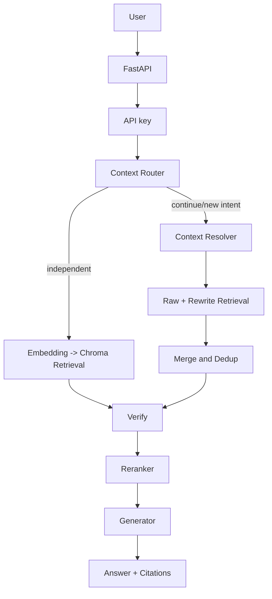

# Enterprise RAG Agent Architecture

## Runtime

Authorization filtering belongs before context reaches generation. The retrieval endpoint and Agent Verify node accept the demo `X-Role` identity and filter metadata using `app.core.permissions`. This is an identity-injection demonstration, not JWT/OAuth/SSO; document ingestion metadata still needs a production management flow.

## Evaluation

Offline evaluation uses an explicit `Settings` object for chunking, embedding, reranking, and a separate Chroma collection. Live Resolver evaluation is a manual path and is never a pytest dependency. `evaluation/metrics.py` contains deterministic Hit@K, MRR, and paired comparison primitives.

## Memory and tools

Short-term state remains in `ChatSession.active_context` and `ChatMessage`. Long-term preferences are stored independently in `UserMemory`, retrieved by user id and added to the generator as explicitly labeled non-knowledge context. Business tools are selected by a deterministic rule router inside LangGraph and executed by `BusinessToolRegistry`. The optional MCP server exposes administrative tools over stdio; an Agent-side remote MCP client is not implemented in this version.

## Design decisions

- `ContextRouter` is rule-based because direct responses, independent queries, continuation and tool phrases are cheap to classify deterministically and remain testable without an LLM.
- `ContextResolver` only reconstructs retrieval intent. The original query remains the generator input while raw and rewritten queries are both retrieved and deduplicated.
- Verify runs before reranking to avoid sending below-threshold candidates into the expensive ranking/generation path.
- Memory is separate from RAG knowledge so user preferences cannot become citations or override document facts.
- Evaluation is separate from live model tests because Hash/lexical runs are reproducible while DeepSeek/BGE runs depend on network, model cache and provider state.
